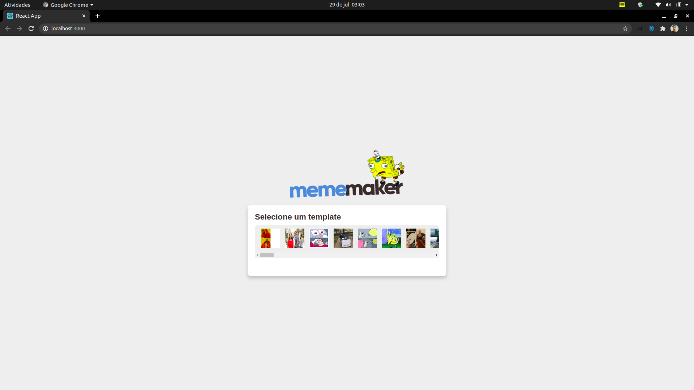
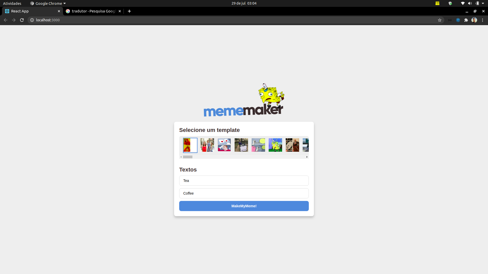
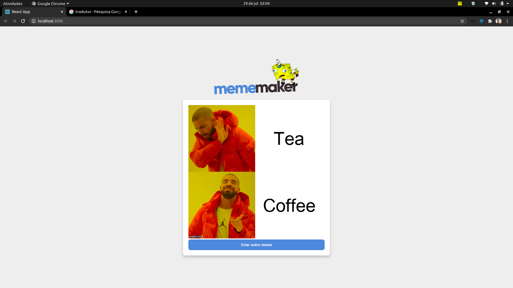

This project was bootstrapped with [Create React App](https://github.com/facebook/create-react-app).

# This is a meme generator made with ReactJS

## Installation

#### In order to test, clone the repository with
`git clone https://github.com/Hilton1/MemeMaker.git`

#### After that, install the dependencies with
`yarn install` or `npm install`

#### After installation, run in your terminal
`yarn start` or `npm start`

#### The `http://localhost:3000/` page will open in your browser. After that, just have fun :D

## Execution example

